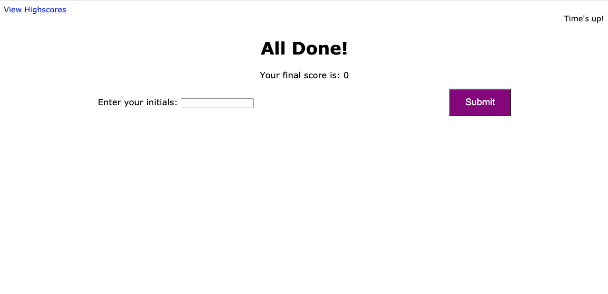

# 04 Web APIs: Code Quiz

Click on the following link to get to the application:
* ['KK JS Code Quiz GitHub IO'](https://kevkouadio.github.io/KK-Code-Quiz/)

The following images demonstrates the application functionality:



### Summary

The application is javascript fundamental code quiz with multiple-choice questions. The app runs in the browser and feature dynamically updated HTML and CSS powered by your JavaScript code. It also feature a clean and polished user interface and is responsive. It adapts to multiple screen sizes.


## Application features

```
WHEN I click the start button,
THEN a timer starts and a question is presented with multiple choices.
Clic to choose the right answer,
THEN another question is presented, 
WHEN the answer is incorrect,
THEN 5 seconds are subtracted from the clock,
WHEN all questions are answered or the timer reaches 0
THEN the game is over
WHEN the game is over
THEN the player can save his/her initials and score.
The final score is the number of correct answers mutltiply by the remaining seconds. 
```
